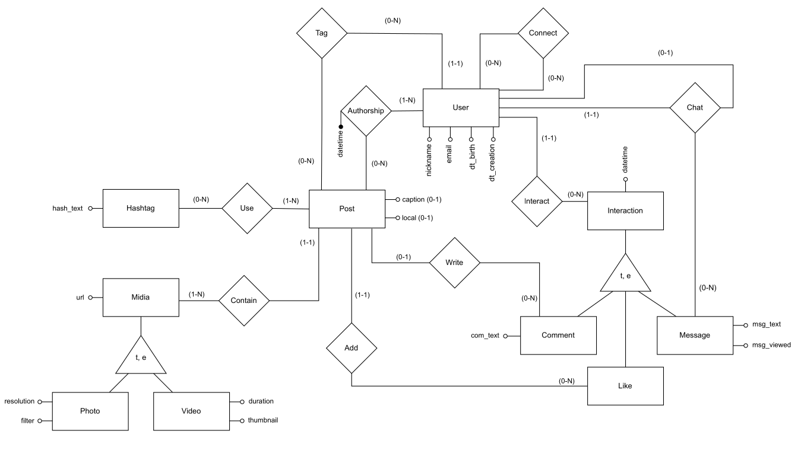

# Instagram DB



Instagram-style social media database model built in PostgreSQL for a Database Fundamentals course (INF01145) at UFRGS.

## Project overview

This repository contains a relational schema and supporting SQL for a social network database inspired by Instagram. It demonstrates normalized design, specialized media tables, interaction hierarchies, trigger-based performance optimization, and analytical reporting queries.

## Files

- `tables.sql` — schema creation for users, posts, midias, hashtags, interactions, and relationship tables
- `instances.sql` — sample data inserts to populate the schema with users, posts, connections, media, likes, comments, and messages
- `triggers.sql` — trigger function to keep `posts.likes_count` updated efficiently
- `queries.sql` — reporting views and complex SQL queries that answer social network business questions

## How to run

1. Create or connect to a PostgreSQL database.
2. Apply the schema:

```bash
psql -d instagram_db -f tables.sql
```

3. Load sample data:

```bash
psql -d instagram_db -f instances.sql
```

4. Add triggers and stored procedures:

```bash
psql -d instagram_db -f triggers.sql
```

5. Review analytical queries:

```bash
psql -d instagram_db -f queries.sql
```


## Skills demonstrated

- PostgreSQL DDL / DML
- Data modeling and normalization
- Trigger and stored procedure development
- SQL reporting and analytics
- Database design for scalable social media features
